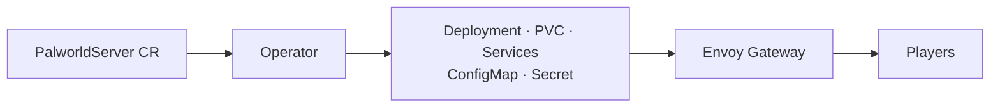

# Palworld Operator

[](https://github.com/DataKnifeAI/palworld-operator/actions/workflows/test.yml)
[](https://github.com/DataKnifeAI/palworld-operator/actions/workflows/lint.yml)
[](https://github.com/DataKnifeAI/palworld-operator/actions/workflows/build.yml)
[](LICENSE)
[](CHANGELOG.md)

<p align="center">
  
</p>

Spin up a [Palworld](https://www.palworldgame.com/) dedicated server on Kubernetes with one CR.
You declare a `PalworldServer`; the operator builds Deployment, PVC, services, and Envoy Gateway exposure around the [official Pocketpair image](https://github.com/pocketpairjp/palworld-dedicated-server-docker).

Congrats to Pocketpair on [Palworld 1.0](https://store.steampowered.com/news/app/1623730/view/686383649529010623) — [1.0 announcement](https://www.pocketpair.jp/en/game-news/palworld-1-0-july-10-cinematic-trailer-revealed/) · [Steam](https://store.steampowered.com/app/1623730/Palworld/).

**Site:** [dataknifeai.github.io/palworld-operator](https://dataknifeai.github.io/palworld-operator/) · **Operator image:** `harbor.dataknife.net/library/palworld-operator`

## How it works



- Default game image: [`ghcr.io/pocketpairjp/palserver`](https://github.com/pocketpairjp/palworld-dedicated-server-docker)
- Credentials: bring-your-own Secret refs, or set `spec.generateSecrets: true`
- No cluster? Same official image via [Docker Compose](docs/LOCAL.md) (`make compose-up`)

Full resource layout: [docs/ARCHITECTURE.md](docs/ARCHITECTURE.md).

## Local / minimal PC (no Kubernetes)

```shell
cp compose/.env.example compose/.env   # set SERVER_PASSWORD / ADMIN_PASSWORD
make compose-up
# Join Multiplayer Game → 127.0.0.1:8211
make compose-down
```

Details (RAM, ports, LAN): [docs/LOCAL.md](docs/LOCAL.md).

## Quick start (Kubernetes)

Prerequisites: Kubernetes 1.28+, [Envoy Gateway](https://gateway.envoyproxy.io/) (`GatewayClass` `envoy`), a StorageClass for saves, and one dedicated external IP per server (`spec.gateway.address`).

```shell
# Optional: bring-your-own credentials (skip if using spec.generateSecrets: true)
kubectl -n game-servers create secret generic palworld-server-secrets \
  --from-literal=admin-password='CHANGE_ME_ADMIN' \
  --from-literal=server-password='CHANGE_ME_JOIN'

kubectl apply -k config/default
kubectl apply -f config/samples/palworld_v1alpha1_palworldserver.yaml
kubectl get palworldserver -n game-servers
```

Connect with `.status.connectionAddress` / `.status.connectionPort` (default `8211` UDP).
**Known limitation:** the operator does not manage `DedicatedServerName` in `GameUserSettings.ini` — without a pin, a restart can load a new empty world (see [docs/PALWORLD_SERVER.md](docs/PALWORLD_SERVER.md#world-selection-across-restarts)).
Read join/admin passwords from the credentials Secret ([docs/CONNECT.md](docs/CONNECT.md)):

```shell
kubectl get secret palworld-server-secrets -n game-servers \
  -o jsonpath='{.data.server-password}' | base64 -d; echo
```

Tune the [sample CR](config/samples/palworld_v1alpha1_palworldserver.yaml) for VIP, StorageClass, and resources — BYO Secret or `generateSecrets: true`.

```shell
kubectl delete palworldserver palworld-server -n game-servers
```

## Docs

| Doc | Contents |
|-----|----------|
| [docs/FAQ.md](docs/FAQ.md) | Incapable version, passwords, world pin, updates, sizing |
| [docs/LOCAL.md](docs/LOCAL.md) | Docker Compose — local / minimal PC |
| [docs/CONNECT.md](docs/CONNECT.md) | In-game join, passwords, community, crossplay |
| [docs/ARCHITECTURE.md](docs/ARCHITECTURE.md) | Owned resources, Gateway layout |
| [docs/PALWORLD_SERVER.md](docs/PALWORLD_SERVER.md) | Ports, mounts, INI/env, Steam updates |
| [docs/GITLAB_MIRROR.md](docs/GITLAB_MIRROR.md) | GitHub CI + GitLab Harbor publish |
| [CHANGELOG.md](CHANGELOG.md) | Release notes / known gaps |

## Development

Go 1.25+ and [golangci-lint](https://golangci-lint.run/). Common targets: `make generate manifests`, `make test`, `make lint`, `make ci`, `make build`.
See [docs/GITLAB_MIRROR.md](docs/GITLAB_MIRROR.md) and [TASKS.md](TASKS.md).

## License

Apache License 2.0 — see [LICENSE](LICENSE).
Maintained by [DataKnifeAI](https://github.com/DataKnifeAI).
